# GrimReaper

## Introduction
- "Grim Reaper" is a single-player 3D action-adventure mobile game that immerses players in the captivating journey of a young boy on a quest to recover his lost memories and ultimately ascend to the role of the Grim Reaper, all with the help of his newfound friend, Crow. 

## Game Scene
### Game Start
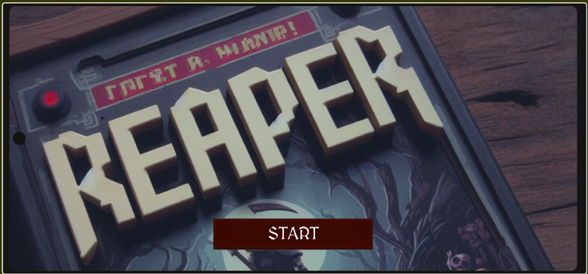

### Main Menu
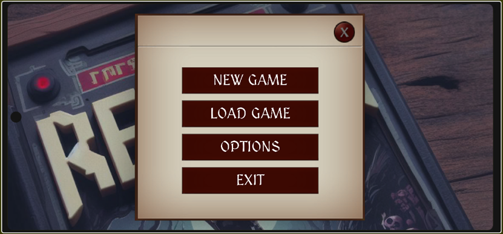
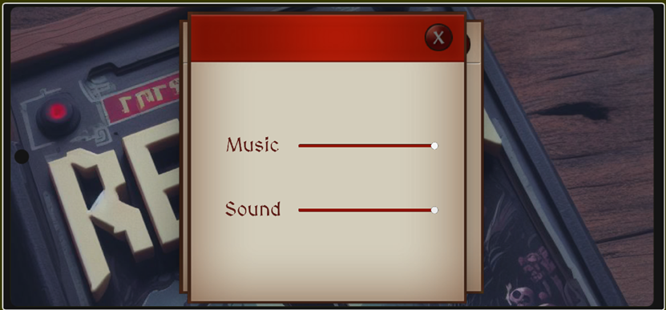

### Tutorial
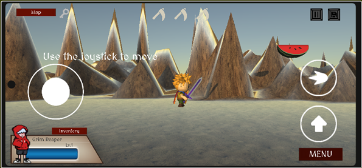
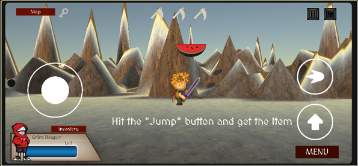
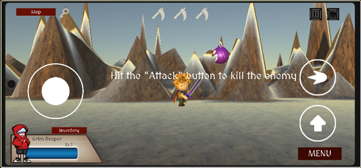

### Features

#### Achievement
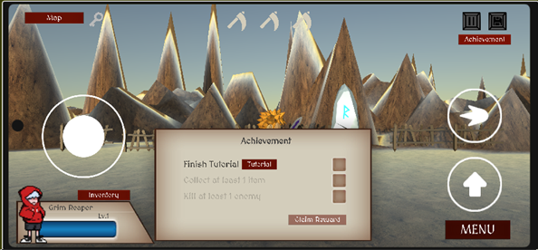

#### Inventory
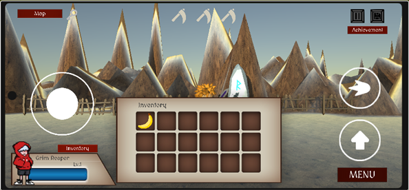

#### Mini Map
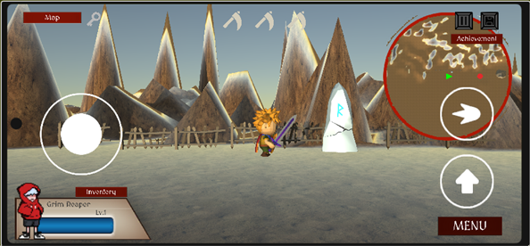

#### Game Pause
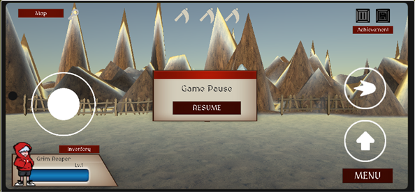

#### Game Save
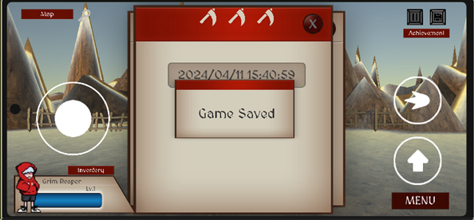

### Level 
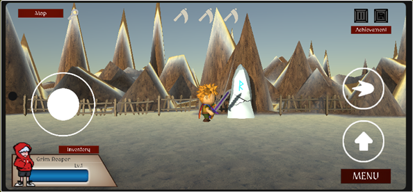
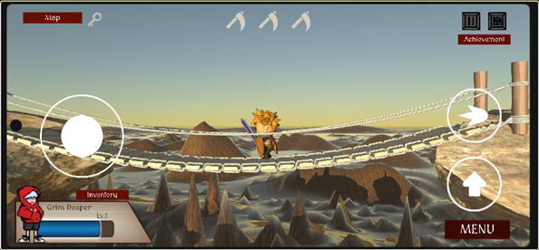
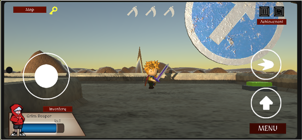
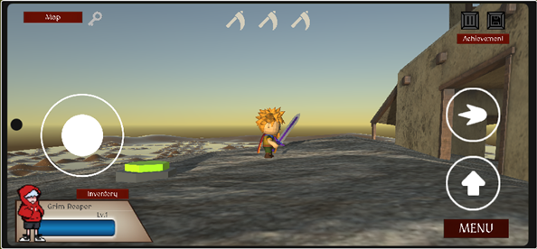
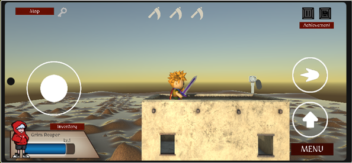
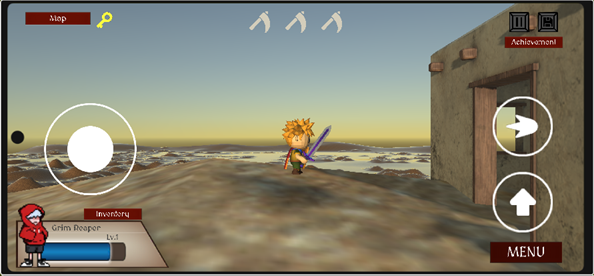

### Game Win
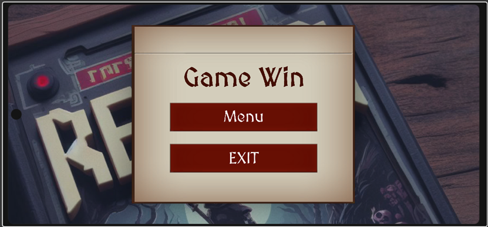

### Game Over
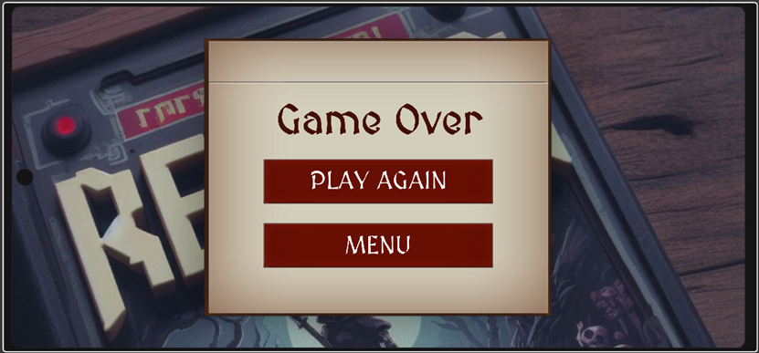

## Build & Source Code
- Demonstration Video: TBA
- WebGL Version Available (PC): https://yobisaboy.itch.io/grim-reaper-pc
- Game Download: https://github.com/yobisaboy/GrimReaper
- Unity Project: https://github.com/yoyohohoh/comp290_project

## Contact
- Tel: +1 (647) 637-0831
- Email: hoyiuyiuyoyo@gmail.com
- LinkedIn: https://www.linkedin.com/in/yoyoho
- Portfolio: https://yobisaboy.github.io/Portfolio
